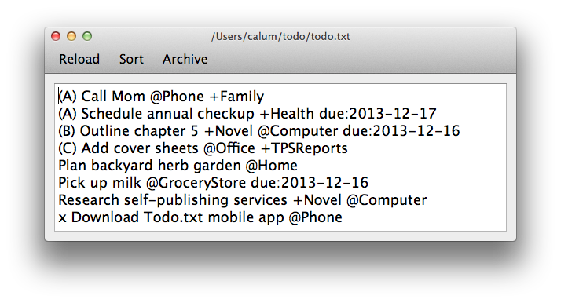
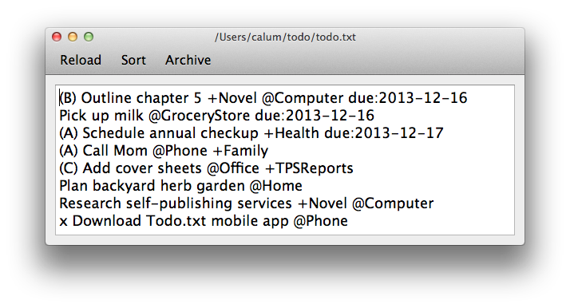
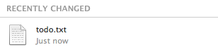

done
====

A lean graphical interface for your todo.txt file.

Features
--------

- Simple, direct manipulation. Use a text editor component for modifying your todo.txt, rather than the indirection of the command line client or row based GUI clients.
  
- Sort by due date.
  
- Instant update. If you're using a service like Dropbox, any changes made in the editor are synced across all your devices straight away, like the Todo.txt Android App.

  

Usage
-----

```sh
git clone git@github.com:CalumJEadie/done.git
cd done
./done.sh
```

Dependancies
------------

[PySide](http://qt-project.org/wiki/PySide) - Python Qt bindings

Motivation
----------

A _"lets see what you can get done in an evening"_ project!

I'm a huge fan of Gina Trapani's [todo.txt](http://todotxt.com/) method for managing a todo list. I'd thought about what a [GUI for todo.txt](http://www.calumjeadie.com/2013/12/01/what-would-a-really-optimised-GUI-for-Todo.txt-look-like%3F.html) could like before and this is a very basic implementation of those ideas.

Contributing
------------

Contributions are very welcome!

Key issues:

- [ ] Difficult to install dependancies and run. Would be great if someone with experience of packaging PySide apps could suggest how to go about this.

License
-------

done is licensed under a MIT license. See LICENSE.txt.

Resources
---------

http://todotxt.com/

https://github.com/ginatrapani/todo.txt-cli/wiki/The-Todo.txt-Format

http://todotxt.com/todo.txt